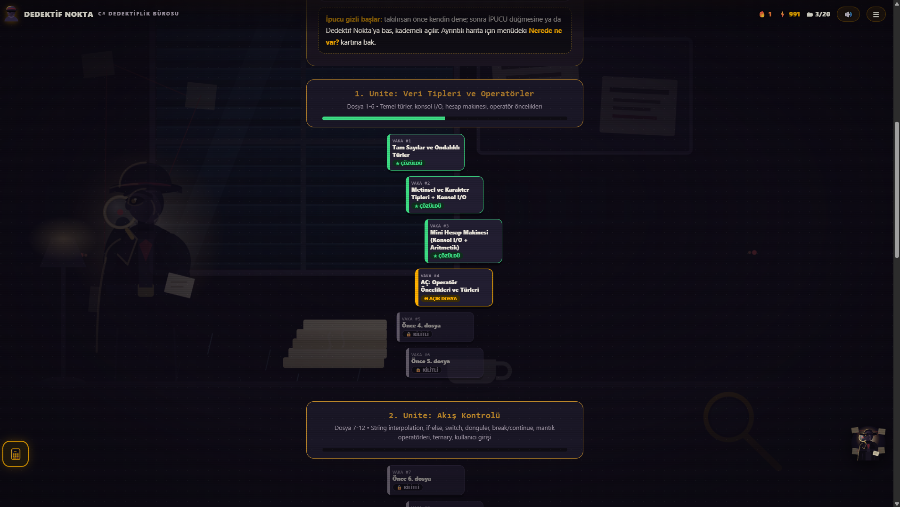
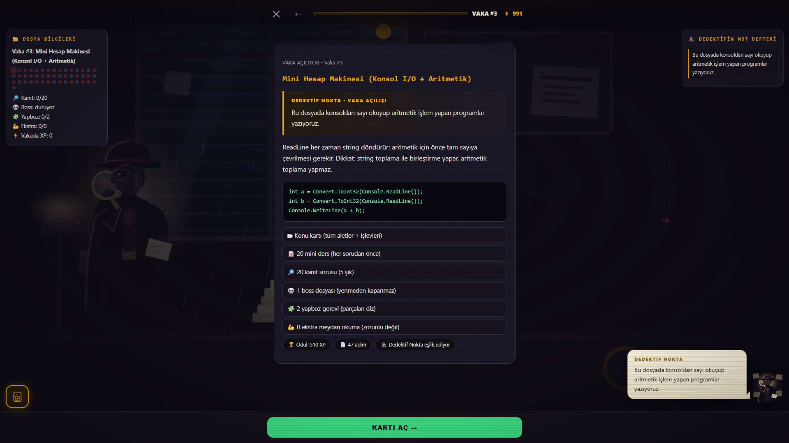
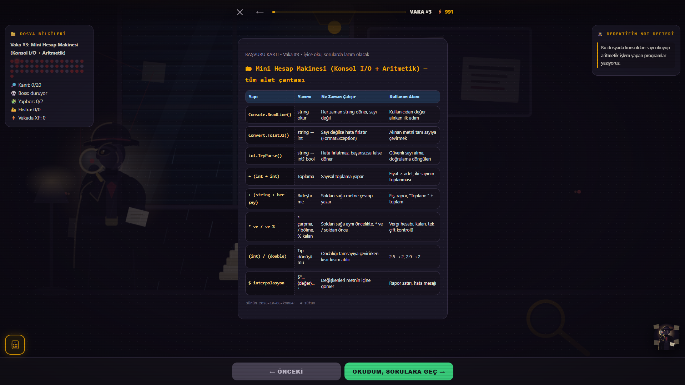
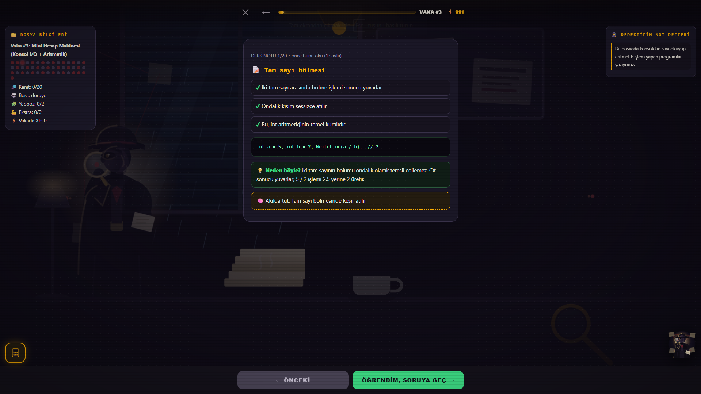
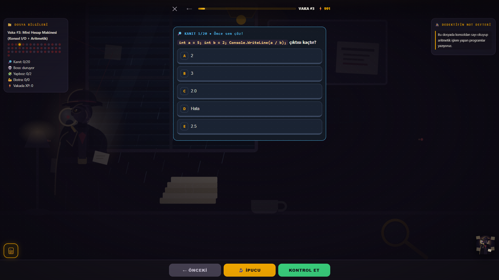

# C# Dedektiflik Bürosu — Dedektif Nokta

C# programlama öğrenmek için tarayıcı tabanlı, senaryo odaklı bir HTML/JS oyunu. Dedektif Nokta'nın masasında C#'ın temellerini 23 vakada çözersin: konsol, döngüler, metotlar, koleksiyonlar, stringler, OOP ve daha fazlası.

## Özellikler

- 🎮 Birleşik senaryo tabanlı ilerlemeli 23 dosya (vaka)
- ✅ Soru kartları, kanıt sorusu, kod tamamlama, yapboz, boss dosya ve ekstralar
- 🔥 Günlük seri ve XP sistemi (`localStorage` + Firestore)
- 👤 Google hesabıyla giriş; save farklı cihazlarda senkron
- 🕵️‍♂️ Noir teması, yağmur/pencere/ofis arkaplan, maskot ipuçları
- 📱 Mobil ve masaüstü uyumlu arayüz
- ✔️ 46 KOD TAMAMLA sorusu her push'ta CI'da derlenip doğrulanır; diğer sorular elle gözden geçirilmiştir
- 📦 PWA: `sw.js` ile çevrimdışı önbellek

## Ekran Görüntüleri

| Dosya Arşivi / Rehber                                  | Vaka Açılışı                                          |
| ------------------------------------------------------ | ----------------------------------------------------- |
|  |  |

| Başvuru Kartı                                           | Ders Notu                                       |
| ------------------------------------------------------- | ----------------------------------------------- |
|  |  |

| Kanıt Sorusu                                          |
| ----------------------------------------------------- |
|  |

## Proje Yapısı

```
index.html              # Sayfa iskeleti
style.css               # Tüm stiller
app.js                  # Oyun mantığı
data.js                 # DERSLER + KODTAMAMLALAR soru verisi
firebase-config.js      # Firebase bağlantısı
sw.js, sw-register.js   # Service worker (çevrimdışı)
scripts/validate-questions.mjs # dotnet doğrulama (Node)
scripts/make-firebase-config.mjs # ortam değişkenlerinden config üretir
tests/data.test.mjs           # soru verisi bütünlük testleri
js/auth.js                    # Firebase giriş + kayıt senkronu
firebase-config.example.js    # config şablonu (gerçek dosya repoda yok)
tools/validator/        # .NET doğrulama projesi
firestore.rules         # Firestore güvenlik kuralları
.github/workflows/ci.yml       # CI: dotnet doğrulama + Prettier
```

## Teknolojiler

- HTML / CSS / JavaScript (frameworksüz)
- Firebase Authentication (Google) + Cloud Firestore
- .NET 10 SDK (içerik doğrulama)
- Netlify üzerinde yayınlanabilir (`netlify.toml`)

## Kurulum

```bash
npm install          # bağımlılık yok, sadece geliştirme araçları için
npm start            # http://localhost:8000
```

> Port 8000 şart: Firebase API key referrer kısıtlaması `localhost:8000`'e izin veriyor.
> Başka port kullanırsan Google girişi `Referer denied` hatası verir.

### Firebase yapılandırması

Gerçek `firebase-config.js` **repoda tutulmaz**; ortam değişkenlerinden üretilir.

```bash
# .env dosyası oluştur (gitignore'da), sonra:
npm run dev:config
```

Gerekli değişkenler: `FIREBASE_API_KEY`, `FIREBASE_AUTH_DOMAIN`, `FIREBASE_PROJECT_ID`, `FIREBASE_STORAGE_BUCKET`, `FIREBASE_MESSAGING_SENDER_ID`, `FIREBASE_APP_ID`.

Değişkenler tanımlı değilse site **yapılandırmasız modda** açılır: oyun tam çalışır, giriş ve cihazlar arası senkron kapalı olur.

Kendi Firebase projeni kullanacaksan: `Authentication > Google` ve `Firestore`'u aktif et, domain'i `Authorized domains`'e ekle, kuralları `firestore.rules` dosyasından kopyala.

### Netlify'da yayınlama

1. Klasörü Netlify'a sürükle veya GitHub'dan import et
2. **Site configuration > Environment variables** bölümüne yukarıdaki 6 değişkeni ekle
3. `netlify.toml` build sırasında `firebase-config.js`'i otomatik üretir

## Testler ve doğrulama

```bash
npm test             # soru verisi bütünlüğü (cevap anahtarı, id tekliği, boşluk/kabul eşitliği)
npm run validate     # KOD TAMAMLA sorularını .NET ile derleyip çıktıları karşılaştırır
npm run format:check # biçim kontrolü
```

CI her push/PR'da bu üç adımı koşar.

### Bilinen eksik

Vaka 20 ("Beceri Temelli Soru 2") şu an yalnızca 2 KOD TAMAMLA sorusu içeriyor; çoktan seçmeli sorusu ve boss sorusu yok. Bu durum `tests/data.test.mjs` içinde açıkça işaretli ve düzeltildiğinde test güncellenir.

### Doğrulama kapsamı

`npm run validate` yalnızca KOD TAMAMLA tipindeki soruları derler (`satirlar` + `kabul` + `cikti` alanları makine-okunurdur); çoktan seçmeli ve nüanslı soruların doğruluğu `npm test` ile yapısal olarak, içerik olarak ise elle kontrol edilir.

## Katkı

`CONTRIBUTING.md` dosyasına bak. İçerik önerileri için issue şablonunu kullan.

## Kayıtlar / Lisans

- Proje kodu (`index.html`, `app.js`, `js/auth.js`, `style.css`, `sw.js` vb.): MIT (`LICENSE`).
- Soru verisi (`data.js`): tr.wikibooks _C#_ kaynaklarından (CC BY-SA 4.0) esinli hazırlanmıştır; içerik lisansı ayrıca `LICENSE-CONTENT.md`'de belirtilmiştir.
